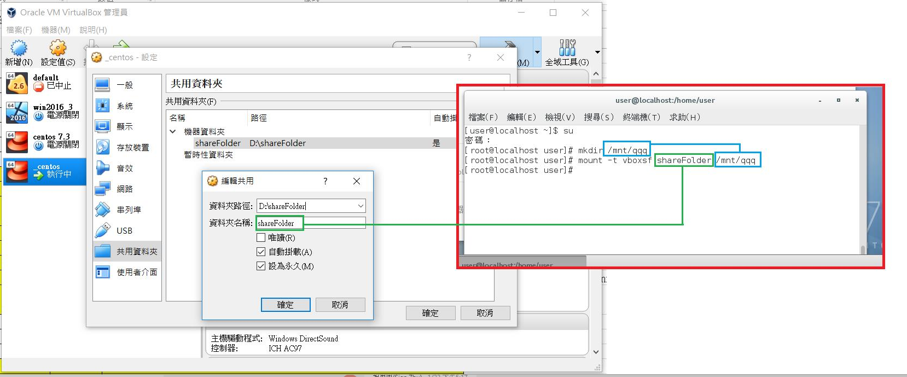

# CentOS 7.6

### Host only adapter 

In newer versions of VirtualBox select from **File menu** &gt; **Host network manager**. Add Host only adaptor

### VMSVGA

VirtualBox預設顯示模式為VMSVGA


### full screen \(o\)



yum install dkms

yum groupinstall "Development Tools" 

yum install kernel-devel

安裝的版本要相同

### full screen \(x\)

yum install gcc kernel-devel

rpm -qa kernel\* \| sort

yum remove kernel........

sh VBoxLinuxAdditions.sh

VirtualBox預設顯示模式為VMVGA

reboot 

f1

[https://www.youtube.com/watch?v=YO3Vp8dZIyo](https://www.youtube.com/watch?v=YO3Vp8dZIyo)

boot server, press "e"

at the end ot the "linux16" line : added selinux=0 \(to disable SELinux and allow boot to succeed as described by Terrence\)

ctrl+x

login to server and reinstall selinux-policy-targeted

yum reinstall selinux-policy-targeted

touch /.autorelabel

systemctl reboot

after reboot check SELinux status

sestatus

  
**★★ 暫時性的關掉或開啟 selinux ★★** 

$ getenforce  
Enforcing  
$ sudo setenforce 0  
$ getenforce  
Permissive  
$ sudo setenforce 1  
$ getenforce  
Enforcing  


**★★ 永久性的關掉 selinux ★★** 

$ sudo vi /etc/sysconfig/selinux     

找到  
SELINUX=enforcing  
然後修改為  
SELINUX=disabled  
要重新開機 reboot / restart 後才會套用


### Copy and Paste\(ok\)

### Network\(ok\)

### SSH

yum install openssh openssh-server

vi /etc/ssh/sshd\_config

AllowUsers 帳號1 帳號2 帳號3

systemctl restart sshd.service

systemctl enable sshd.service \(設定下次開機時，後面接的 unit 會被啟動\)

firewall-cmd --permanent --zone=public --add-port=22/tcp

firewall-cmd --reload

virtual box port forward 

### SSH root

vi /etc/ssh/sshd\_config

AllowUsers root user

PermitRootLogin yes

### sudo

is not in the sudoers file. This incident will be reported

su

chmod u+w /etc/sudoers

vi /etc/sudoers

xxx ALL=\(ALL\) ALL

chmod u-w /etc/sudoers


sudo vi /etc/sudoers 

或 

sudo visudo 就是去編輯設定檔。

將這行 %sudo ALL=\(ALL:ALL\) ALL 改成 %sudo ALL=\(ALL:ALL\) NOPASSWD:ALL

### sharedFolder

```text
sudo yum install git
```



don't need to shutdown   
mkdir /mnt/shareFolder   
mount -t vboxsf shareFolder /mnt/shareFolder   
mount.vboxsf shareFolder /mnt/shareFolder   
mounting failed with the error: Protocol error   
不要選自動掛載   
modprobe vboxvfs

### View hidden file

ctrl + h


### Git

sudo yum install git

git --version


### Docker

yum install -y -q docker-ce

yum install docker

systemctl start docker

systemctl enable docker

rpm -qa\|grep docker \(查看docker裝了哪些東西\)

is-active ：目前有沒有正在運作中 

systemctl is-active docker

is-enabled：開機時有沒有預設要啟用這個 unit

systemctl is-enabled docker


sudo groupadd docker

sudo usermod -G docker -a user

sudo systemctl restart docker

### remove docker

sudo yum remove docker docker-common docker-selinux docker-engine

### upgrade docker

$ sudo yum -y update

$ sudo curl -sSL [https://get.docker.com](https://get.docker.com) \| sh

$ sudo systemctl enable docker

$ sudo systemctl start docker

$ sudo ps aux \|grep docker

$ sudo systemctl status docker

### install docker compose

[https://docs.docker.com/compose/install/](https://docs.docker.com/compose/install/)

sudo curl -L "[https://github.com/docker/compose/releases/download/1.24.0/docker-compose-$\(uname](https://github.com/docker/compose/releases/download/1.24.0/docker-compose-$%28uname) -s\)-$\(uname -m\)" -o /usr/local/bin/docker-compose

sudo chmod +x /usr/local/bin/docker-compose

sudo ln -s /usr/local/bin/docker-compose /usr/bin/docker-compose

docker-compose --version


### dial unix /var/run/docker.sock: connect: permission denied

groupadd docker

ls -la /var/run/docker.sock

chown :docker /var/run/docker.sock

usermod -g docker user


Change the owner of a file: chown root file

Change the group of a file: chown :friends file

chown -R user:user file

recursive change??????????????

### Firewall

su

firewall-cmd --zone=public --add-port=6379/tcp --permanent  
firewall-cmd --zone=public --add-port=8000-9999/tcp --permanent  
firewall-cmd --reload  
firewall-cmd --zone=public --list-all

### Firewall remove port

firewall-cmd --zone=public --permanent --remove-port=8000-9999/tcp  
firewall-cmd --reload

### Docker run command parameter

--restart always  

docker pull jenkins/jenkins:lts gitlab/gitlab-ce:latest postgres:latest sonarqube

### Jenkins

jenkins on centos: [https://oranwind.org/-devops-jenkins-an-zhuang-jiao-xue/](https://oranwind.org/-devops-jenkins-an-zhuang-jiao-xue/)  
jenkins on docker: [https://ithelp.ithome.com.tw/articles/10200621?sc=iThelpR](https://ithelp.ithome.com.tw/articles/10200621?sc=iThelpR)

sudo mkdir -p /app/jenkins  
sudo chown -R $USER:$GROUP /app/jenkins

windows /app -&gt; /c/Users/app

docker run -d \  
--name jenkins \  
--network myNetwork \  
-p 9003:8080 \  
-p 50000:50000 \  
-v /app/jenkins:/var/jenkins\_home \  
jenkins/jenkins:lts

localhost:9003  
cat /app/jenkins/secrets/initialAdminPassword  
admin/admin

Global Tool Configuration/Maven installations/Install automatically  
-f ./source/ckms clean package -U sonar:sonar -Dsonar.host.url=[http://sonarqube:9000](http://sonarqube:9000) -Dsonar.sourceEncoding=UTF-8


sonar:sonar -Dmaven.test.skip=ture -Dsonar.host.url=[http://sonarqube:9000](http://sonarqube:9000) -Dsonar.sourceEncoding=UTF-8 -Dsonar.login=3596ad9b3c7fb2e855d739389ffa4234d2be29a0

### Gitlab

gitlab on docker: [https://blog.toright.com/posts/5831/%E4%B8%89%E7%A7%92%E6%95%99%E4%BD%A0%E7%94%A8-docker-%E5%AE%89%E8%A3%9D-gitlab.html](https://blog.toright.com/posts/5831/%E4%B8%89%E7%A7%92%E6%95%99%E4%BD%A0%E7%94%A8-docker-%E5%AE%89%E8%A3%9D-gitlab.html)

sudo mkdir -p /app/gitlab/config /app/gitlab/logs /app/gitlab/data  
sudo chown -R $USER:$GROUP /app/gitlab

sudo docker run --detach \  
--hostname gitlab.example.com \  
--publish 443:443 \  
--publish 9004:80 \  
--name gitlab \  
--network myNetwork \  
--volume /app/gitlab/config:/etc/gitlab \  
--volume /app/gitlab/logs:/var/log/gitlab \  
--volume /app/gitlab/data:/var/opt/gitlab \  
gitlab/gitlab-ce:latest

localhost:9004  
root/P@ssw0rd

### PostgreSQL

docker network create myNetwork  
docker network list

sudo mkdir -p /app/postgres  
sudo chown -R $USER:$GROUP /app/postgres

docker run -d \  
--name postgres \  
--network myNetwork \  
-p 9006:5432 \  
-v /app/postgres:/var/lib/postgresql/data \  
-e POSTGRES\_DB=sonar \  
-e POSTGRES\_USER=admin \  
-e POSTGRES\_PASSWORD='admin' \  
postgres:latest

### Sonarqube

docker run -d \  
--name sonarqube \  
--network myNetwork \  
-p 9005:9000 \  
-e sonar.jdbc.username=admin \  
-e sonar.jdbc.password=admin \  
-e sonar.jdbc.url="jdbc:postgresql://postgres:5432/sonar" \  
sonarqube

localhost:9005

admin/admin

### Oracle DB

```text
docker pull store/oracle/database-enterprise:12.2.0.1-slim
docker run -d -it --name OraDevDB -p 1521:1521 store/oracle/database-enterprise:12.2.0.1-slim
docker exec -it OraDevDB bash -c "source /home/oracle/.bashrc; sqlplus /nolog"
SQL> connect sys as sysdba;
SQL> alter session set "_ORACLE_SCRIPT"=true;
SQL> create user tuser identified by tuser;
SQL> GRANT CONNECT, RESOURCE, DBA TO tuser;
SQL> select value from v$parameter where name='service_names';
SQL> disconnect;

ORCLCDB.localdomain

firewall-cmd --zone=public --add-port=1521/tcp --permanent
firewall-cmd --reload
```


### Host

cat /etc/hosts

### 加大 CentOS 虛擬機硬碟空間

"C:\Program Files\Oracle\VirtualBox\VboxManage.exe" modifyhd "centos 7.3.vdi" --resize 61440

下載 GParted Live CD 

lvresize -l +100%FREE /dev/cl/root 

xfs\_growfs /dev/cl/root

[http://oldgrayduck.blogspot.com/2016/07/virtualbox-centos.html](http://oldgrayduck.blogspot.com/2016/07/virtualbox-centos.html)


### df -h

檔案系統 容量 已用 可用 已用% 掛載點   
/dev/mapper/cl-root 37G 24G 14G 64% /   
devtmpfs 2.9G 0 2.9G 0% /dev   
tmpfs 3.0G 0 3.0G 0% /dev/shm   
tmpfs 3.0G 9.3M 3.0G 1% /run   
tmpfs 3.0G 0 3.0G 0% /sys/fs/cgroup   
/dev/sda1 1014M 165M 850M 17% /boot   
tmpfs 597M 12K 597M 1% /run/user/42   
tmpfs 597M 0 597M 0% /run/user/1000

### lsblk

NAME MAJ:MIN RM SIZE RO TYPE MOUNTPOINT   
sda 8:0 0 40G 0 disk   
├─sda1 8:1 0 1G 0 part /boot   
└─sda2 8:2 0 39G 0 part   
     ├─cl-root 253:0 0 37G 0 lvm /   
     └─cl-swap 253:1 0 2G 0 lvm \[SWAP\]   
sr0 11:0 1 82M 0 rom


### NMAP: similar to telnet

nmap -p 1521 10.146.208.5

wget ip:port

[https://www.cyberciti.biz/faq/ping-test-a-specific-port-of-machine-ip-address-using-linux-unix/](https://www.cyberciti.biz/faq/ping-test-a-specific-port-of-machine-ip-address-using-linux-unix/)

